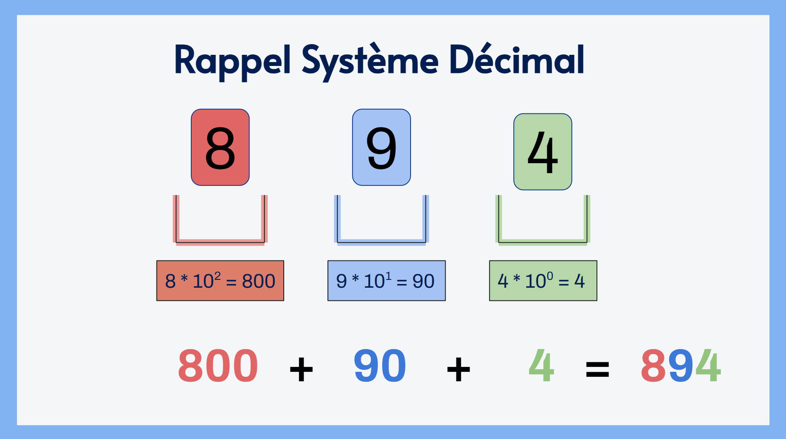
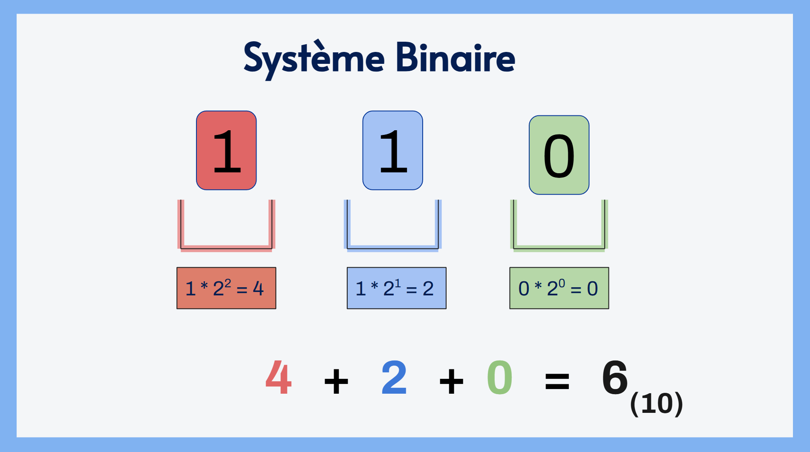
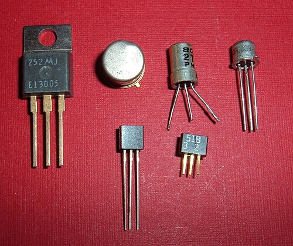
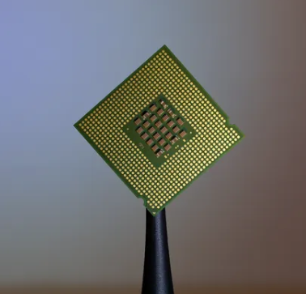
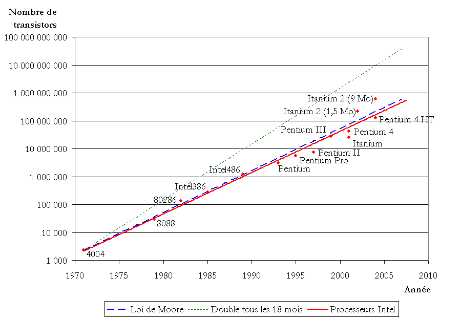
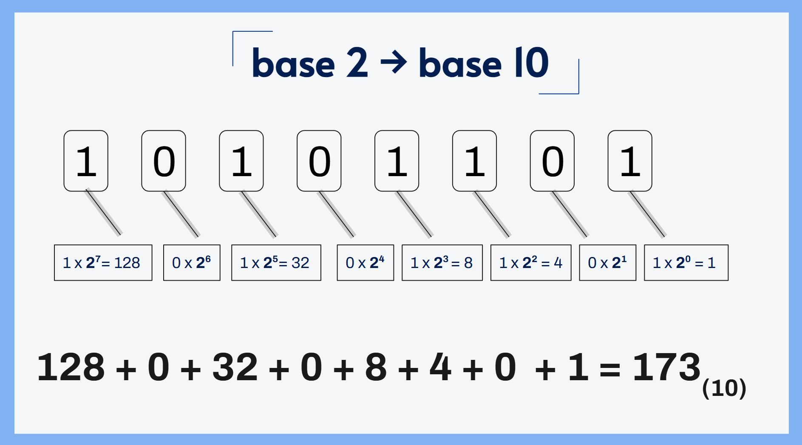
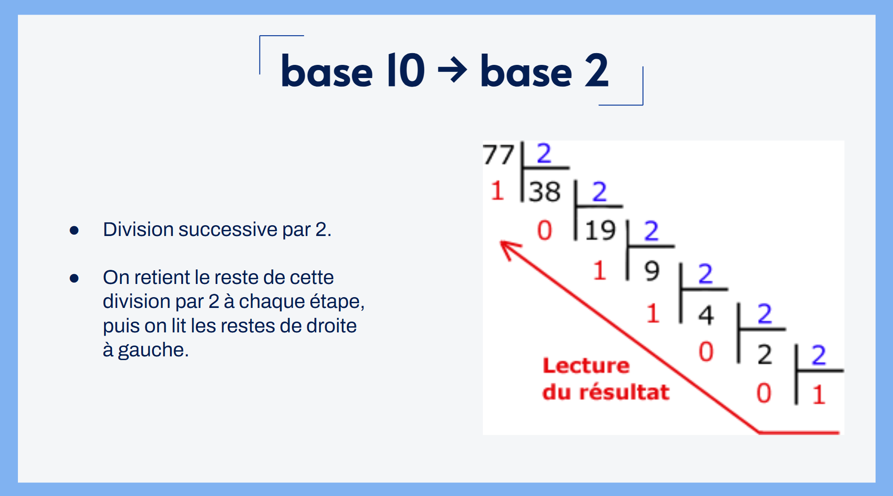
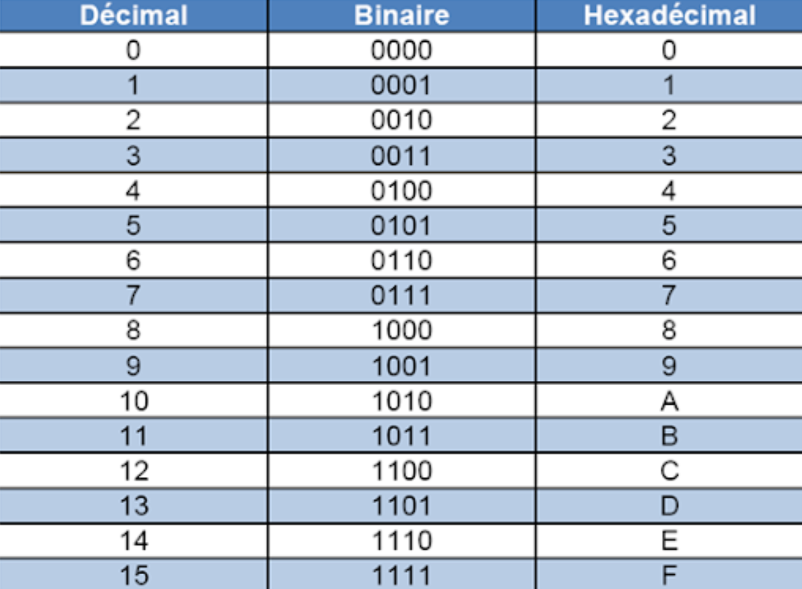

# Thème 1 - Représentation des données
___
# 1. Système décimal, binaire et hexadécimal.

## Rappel des bases
> :pencil: Voici un petit jeu simple : **décomposez 894.**

??? info "Rappel visuel **système décimal**"

    
    

    Eh oui, vous avez 10 doigts :raising_hands: et on compte en "paquet" de 10, un hasard ?  
    On appelle le système sur lequel on calcul, le système **décimal**.

> :crayon: Activité débranchée [*"Binary cards"*](https://www.csunplugged.org/en/resources/binary-cards/)

!!! note "Questions :"
    1. A quoi correspondent les chiffres sur les cartes ?
    2. Pourquoi je n’ai pas besoin d’une carte « 3 »
    3. Avec 3 cartes (1, 2, 4), combien de nombres différents peut-on représenter ?
    4. Représentez les nombres 0, 23, 68, 127, ...
    5. Avec 6 cartes (jusqu’à 32), quel est le plus grand nombre que l’on peut représenter ?

    Plus loin !  

    6. A quoi correspond la carte la plus à droite ?  
    7. Savez-vous combien de bits on utilise dans un ordinateur pour représenter un entier classique ?  
    8. Représentez le nombre 23, puis ajoute 5 en manipulant uniquement les cartes (sans calcul mental).

!!! tip "Exemple visuel **système binaire**"
    

## 1.2 :pencil: Exercices

!!! note "Sortez une feuille !!!"

    Convertissez les nombres suivants dans leur base correspondante :   
    a. 7810  &rarr;  ?2  

    b. 15710  &rarr;  ?2  

    c. 0101 10102 &rarr; ?10  

    d. 0111 11112 &rarr; ?10  

    e. :fire: Sur deux octets : 457710

    ??? success "Correction" 
        a. 0100 11102 (sur un octet)
        
        b. 1001 11012 (sur un octet)

        c. 9010

        d. 12710

        e. 0001 0001 1110 00012
___

# 2. Mais au fait... pourquoi on parle de bits ?

## 2.1 L'origine des ordinateurs

Petit question simple : **Savez-vous ce que c'est ?**
       
[{: .center width="50%"}](https://fr.wikipedia.org/wiki/Transistor)

??? info ":electric_plug: :high_voltage:"
    [**Le transistor**](https://fr.wikipedia.org/wiki/Transistor) est le composant fondamental des ordinateurs. Il détermine (en partie), la puissance de calcul de vos ordinateurs.

    > Un transistor permet de faire passer un courant électrique, ou non.  
    On peut traduire cela par : courant électrique, l'ordinateur comprend 1.  
    Pas de courant électrique, l'ordinateur comprend 0.

    Dans quel composant de votre ordinateur se trouvent ces transistors ?

    &rarr; [**Le processeur ! (ou CPU)**](https://fr.wikipedia.org/wiki/Processeur) :heart:

    
 

    <u>Définition</u> : Le **processeur** est un composant électronique, composé de milliard de transistors. C'est lui qui se charge de traduire le langage machine (suite de bits) en instructions.

     
    

## 2.2 La loi de Moore

[La loi de Moore](https://fr.wikipedia.org/wiki/Loi_de_Moore) est la suivante : *"l'évolution de la puissance de calcul des ordinateurs double tous les deux ans"*.

{: .center width=80%}

Croissance du nombre de transistors dans les microprocesseurs Intel par rapport à la loi de Moore.
{: .caption}

!!! abstract "Nombre de transistors de nos jours"
    En 1975, il y avait environ 10 000 'transistors' dans les ordinateurs.  

    Ce nombre double tous les 2 ans.

    De 1975 à 2026, il y a 51 ans.

    1. Combien de fois a-t-on doublé de nombre de transistors de 1975 à 2026 ?
    2. Quel serait le nombre de transistors contenus dans un microprocesseur Intel en 2026 ?
    
    ??? success "Correction"
        1. 51 * 12 mois = 612 périodes  
        612 / 24 mois = 25.5 &rarr; 26  
        &rarr; On a doublé 26 fois le nombre de transistors depuis 1975

        2. 10 000 * 226 = 671 088 640 000  
        &rarr; En 2026, les microprocesseurs contiendraient plus de 670 milliards de transistors !!

___ 
# 3. Les conversions des bases

Comme vous l'avez compris, vos ordinateurs ne comprennent et n'interprètent uniquement **0** et les **1**.

Et vous, petits humains, comprenez et interprétez tous les chiffres de **0** à **9**.

Vous allez faire tous types de conversions à la main, afin de vous mettre dans la peau de votre ordinateur :robot: .

## 3.1 De la base 2 à la base 10

&rarr; Dans un nombre binaire, chaque bit correspond à une puissance de 2. 

Sur un octet, les puissances vont de 20 à 27.

!!! info "Exemple visuel"
    

!!! tip "**Méthode de conversion** :heart: "

    Une méthode que j'aime beaucoup, est de passer par un tableau des puissances de 2 :

    | 27 | 26 | 25 | 24 | 23 | 22 | 21 | 20 ||
    |---|---|---|---|---|---|---|---|:---|
    |128|64|32|16|8|4|2|1|**somme :**|
    |1|0|1|0|1|1|0|1|173|
    |1|1|0|0|0|1|1|0|?|
    |1|1|1|1|1|1|1|1|?|
    |...|...|...|...|...|...|...|...|...|

## 3.2 De la base 10 à la base 2

La méthode est plus délicate, nous pouvons passer par une division successive par deux.

Vous vous rappelez de votre CM1 ..? Et bien nous allons refaire des divisions.

!!! info "Exemple visuel"
    

    Ainsi, 7710 correspond à 10011012

!!! note "Sortez une feuille !"

    Convertissez les nombres binaires suivants en bases décimal :  

    a. 

    b. 

    ??? success "Correction" 
        a. 0100 11102 (sur un octet)
        
        b. 1001 11012 (sur un octet)

___

# 4 L'hexadécimal :shaking_face:

Ce système est basé sur des puissances en base 16.
Comme nous n'avons pas de chiffres 'supérieur' à 9, nous employons des lettres.

!!! info "Tableau de correspondance décimal &rarr; hexadécimal :"

    |base 10|base 16|
    |---|---|
    |...|...|
    |9|9|
    |10|A|
    |11|B|
    |12|C|
    |13|D|
    |14|E|
    |15|F|

En in­for­ma­tique, le système hexa­dé­ci­mal est utilisé pour faciliter la li­si­bi­lité de grands nombres comme les longues chaînes de bits.  

Celles-ci sont divisées en groupes de *quatre bits* et con­ver­ties en nombres hexa­dé­ci­maux. 

Le système est utilisé notamment pour les adresses sources et des pro­to­coles Internet, dans les codes ASCIII (exemple : :alien_monster: ) ou dans la des­crip­tion de codes couleurs, ou encore en CSS.

## 4.1 Conversions 

Comme indiqué dans le paragraphe précédent, il est facile de convertir des nombres binaires en hexadécimal, vous avez compris la logique de conversion des bases, je vous donne ce tableau magique pour rapidement passer d'une base à une autre : 

{: .center width=80%}

Tableau de conversion décimal &rarr; binaire &rarr; héxa :heart:
{.caption}

A suivre ...
<!-- # nb négatif
# 0.1 + 0.2 != 0.3

ouvrir avec un ide -->
