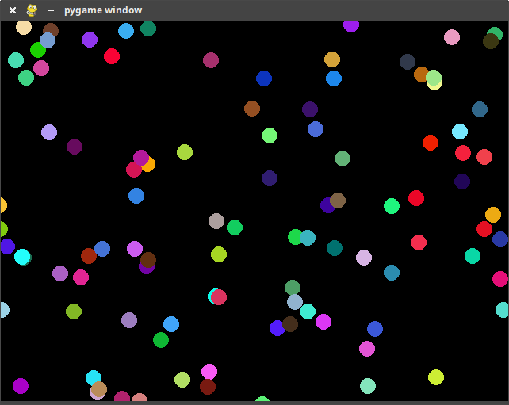
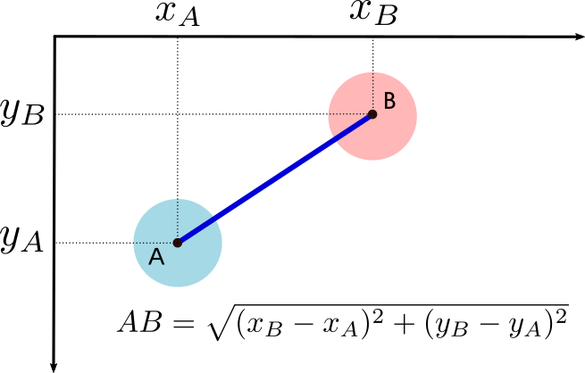

# TP : balles rebondissantes 🎱



---

!!! note "IDE"
    Pour ce TP, vous allez utiliser un IDE (*Integrated Development Environment*). Voici la liste de ceux que je vous conseille :  

    - :star: [Visual Studio Code](https://code.visualstudio.com/) :star: , mon préféré, ultra polyvalent, large choix de bibliothèque et utilisé dans le milieu professionel. :star:  
  
    - [Thonny](https://thonny.org/), accessible pour les débutants, débugage visuel intéressant avec BirdEyes.  
  
    - [Spyder](https://www.spyder-ide.org/), un bazooka pour tuer des mouches, utile pour des lourdes simulations, mais trop lourd pour un.e élève de terminale.
  
    - [IDLE](https://docs.python.org/fr/3/library/idle.html), si vous aimez vous faire du mal. IDE épuré sans fioritures.  
  
    - [NotePad++](https://notepad-plus-plus.org/) 💀

## <font color="blue">1. Prise en main de Pygame</font>

```python linenums='1'
import pygame, sys
import time
from pygame.locals import *

LARGEUR = 640
HAUTEUR = 480
RAYON = 20

pygame.display.init()
fenetre = pygame.display.set_mode((LARGEUR, HAUTEUR))
fenetre.fill([0,0,0])

x = 300
y = 200
dx = 4
dy = -3
couleur = (45, 170, 250)

while True:
    fenetre.fill([0, 0, 0])
    pygame.draw.circle(fenetre, couleur, (x, y), RAYON)

    x += dx
    y += dy

    pygame.display.update()

    # routine pour pouvoir fermer «proprement» la fenêtre Pygame
    for event in pygame.event.get():
        if event.type == pygame.QUIT:
            pygame.display.quit()
            sys.exit()

    time.sleep(0.1)
```


### <font color="teal">1.1 Rajout d'un rebond sur les parois teal</font>

✍️ Modifiez le code précédent afin que la balle rebondisse sur chaque paroi (il suffit de modifier la force des balles lorsqu'elles se trouvent au bord de la fenêtre. Les variables de vitesse sont : `dx` et `dy`).


??? success "Correction"
    ```python
    import pygame, sys
    import time
    from pygame.locals import *

    LARGEUR = 640
    HAUTEUR = 480
    RAYON = 20

    pygame.display.init()
    fenetre = pygame.display.set_mode((LARGEUR, HAUTEUR))
    fenetre.fill([0, 0, 0])


    x = 300
    y = 200
    dx = 4
    dy = -3
    couleur = (45, 170, 250)

    while True:
        fenetre.fill([0, 0, 0])
        pygame.draw.circle(fenetre, couleur, (x, y), RAYON)

        x += dx
        y += dy

        if (y <= RAYON) or (y >= HAUTEUR - RAYON):
            dy = -dy
        if (x <= RAYON) or (x >= LARGEUR - RAYON):
            dx = -dx

        pygame.display.update()

        # routine pour pouvoir fermer «proprement» la fenêtre Pygame
        for event in pygame.event.get():
            if event.type == pygame.QUIT:
                pygame.display.quit()
                sys.exit()

        time.sleep(0.02)
    ```

### <font color="teal">1.2 Rajout d'une deuxième balle </font>

✍️ Attention au nommage des variables...

??? success "Correction"
    ```python
    import pygame, sys
    import time
    from pygame.locals import *

    LARGEUR = 640
    HAUTEUR = 480
    RAYON = 20

    pygame.display.init()
    fenetre = pygame.display.set_mode((LARGEUR, HAUTEUR))
    fenetre.fill([0, 0, 0])


    dxA = 7
    dyA = 4
    dxB = -5
    dyB = 3


    xA = LARGEUR // 3
    yA = HAUTEUR // 2
    xB = LARGEUR // 2
    yB = HAUTEUR // 2


    couleurA = (45, 170, 250)
    couleurB = (155, 17, 250)

    while True:
        fenetre.fill([0, 0, 0])
        pygame.draw.circle(fenetre, couleurA, (xA, yA), RAYON)
        pygame.draw.circle(fenetre, couleurB, (xB, yB), RAYON)

        xA += dxA
        yA += dyA

        xB += dxB
        yB += dyB

        # rebond en haut ou en bas
        if (yA < RAYON) or (yA > HAUTEUR - RAYON):
            dyA = -dyA

        # rebond à gauche ou à droite
        if (xA < RAYON) or (xA > LARGEUR - RAYON):
            dxA = -dxA

        # rebond en haut ou en bas
        if (yB < RAYON) or (yB > HAUTEUR - RAYON):
            dyB = -dyB

        # rebond à gauche ou à droite
        if (xB < RAYON) or (xB > LARGEUR - RAYON):
            dxB = -dxB

        pygame.display.update()

        # routine pour pouvoir fermer «proprement» la fenêtre Pygame
        for event in pygame.event.get():
            if event.type == pygame.QUIT:
                pygame.display.quit()
                sys.exit()

        time.sleep(0.03)
    ```

### <font color="teal">1.3 Gestion de la collision entre les deux balles </font>

✍️ **Q1.** À l'aide d'un schéma (papier-crayon !), mettez en évidence le test devant être réalisé pour détecter une collision.

??? tip "indice"
    

✍️ **Q2.** Implémentez ce test (en créant pour cela une fonction `distance`) et returnez la distance entre les deux balles et affichez ``"collision"`` en console lorsqu'elles se touchent.

??? success "Correction"
    ```python
    import pygame, sys
    import time
    from pygame.locals import *

    LARGEUR = 640
    HAUTEUR = 480
    RAYON = 20

    pygame.display.init()
    fenetre = pygame.display.set_mode((LARGEUR, HAUTEUR))
    fenetre.fill([0, 0, 0])


    dxA = 7
    dyA = 4
    dxB = -5
    dyB = 3


    xA = LARGEUR // 3
    yA = HAUTEUR // 2
    xB = LARGEUR // 2
    yB = HAUTEUR // 2


    couleurA = (45, 170, 250)
    couleurB = (155, 17, 250)


    def distanceAB(xA, yA, xB, yB):
        return ((xA-xB)**2 + (yA-yB)**2)**0.5


    while True:
        fenetre.fill([0, 0, 0])
        pygame.draw.circle(fenetre, couleurA, (xA, yA), RAYON)
        pygame.draw.circle(fenetre, couleurB, (xB, yB), RAYON)

        xA += dxA
        yA += dyA

        xB += dxB
        yB += dyB

        # rebond en haut ou en bas
        if (yA < RAYON) or (yA > HAUTEUR - RAYON):
            dyA = -dyA

        # rebond à gauche ou à droite
        if (xA < RAYON) or (xA > LARGEUR - RAYON):
            dxA = -dxA

        # rebond en haut ou en bas
        if (yB < RAYON) or (yB > HAUTEUR - RAYON):
            dyB = -dyB

        # rebond à gauche ou à droite
        if (xB < RAYON) or (xB > LARGEUR - RAYON):
            dxB = -dxB

        if distanceAB(xA, yA, xB, yB) < 2 * RAYON:
            print('collision')

        pygame.display.update()

        # routine pour pouvoir fermer «proprement» la fenêtre Pygame
        for event in pygame.event.get():
            if event.type == pygame.QUIT:
                pygame.display.quit()
                sys.exit()

        time.sleep(0.03)
    ```

✍️ **Q3.** Pour donner l'illusion physique du rebond, échangez les valeurs respectives de `dx` et `dy` pour les deux balles.

??? success "Correction"
    ```python
    import pygame, sys
    import time
    from pygame.locals import *

    LARGEUR = 640
    HAUTEUR = 480
    RAYON = 20

    pygame.display.init()
    fenetre = pygame.display.set_mode((LARGEUR, HAUTEUR))
    fenetre.fill([0, 0, 0])


    dxA = 7
    dyA = 4
    dxB = -5
    dyB = 3


    xA = LARGEUR // 3
    yA = HAUTEUR // 2
    xB = LARGEUR // 2
    yB = HAUTEUR // 2


    couleurA = (45, 170, 250)
    couleurB = (155, 17, 250)


    def distanceAB(xA, yA, xB, yB):
        return ((xA-xB)**2 + (yA-yB)**2)**0.5


    while True:
        fenetre.fill([0, 0, 0])
        pygame.draw.circle(fenetre, couleurA, (xA, yA), RAYON)
        pygame.draw.circle(fenetre, couleurB, (xB, yB), RAYON)

        xA += dxA
        yA += dyA

        xB += dxB
        yB += dyB

        # rebond en haut ou en bas
        if (yA < RAYON) or (yA > HAUTEUR - RAYON):
            dyA = -dyA

        # rebond à gauche ou à droite
        if (xA < RAYON) or (xA > LARGEUR - RAYON):
            dxA = -dxA

        # rebond en haut ou en bas
        if (yB < RAYON) or (yB > HAUTEUR - RAYON):
            dyB = -dyB

        # rebond à gauche ou à droite
        if (xB < RAYON) or (xB > LARGEUR - RAYON):
            dxB = -dxB

        if distanceAB(xA, yA, xB, yB) < 2 * RAYON:
            dxA, dxB = dxB, dxA
            dyA, dyB = dyB, dyA

        pygame.display.update()

        # routine pour pouvoir fermer «proprement» la fenêtre Pygame
        for event in pygame.event.get():
            if event.type == pygame.QUIT:
                pygame.display.quit()
                sys.exit()

        time.sleep(0.03)
    ```

### <font color="teal">1.4  Rajout d'une troisième balle et gestion du rebond avec les deux autres</font>  

Vraiment ? Peut-on continuer comme précédemment ? Ca va être looooooooooooooooooooooooooooong...

---

## <font color="blue">2. La POO à la rescousse : création d'une classe Balle</font>

### <font color="teal">2.1 La classe Balle </font>

L'objectif est que la méthode constructeur dote chaque nouvelle balle de valeurs aléatoires : abscisse, ordonnée, vitesse, couleur...

- Pour l'aléatoire, on pourra utiliser `randint(a, b)` qui renvoie un nombre pseudo-aléatoire entre `a` et `b`.
  Il faut pour cela importer la fonction, par `from random import randint`

- Vous pouvez aussi doter votre classe `Balle` d'une méthode `dessine` (qui affiche la balle), ainsi qu'une méthode `bouge` qui la fait bouger.

✍️ Créez cette classe et instanciez une balle.

??? success "Correction"
    ```python
    import pygame, sys
    import time
    from pygame.locals import *
    from random import randint

    # randint(0,10) -> nb aléatoire entre 0 et 10

    LARGEUR = 640
    HAUTEUR = 480
    RAYON = 20

    pygame.display.init()
    fenetre = pygame.display.set_mode((LARGEUR, HAUTEUR))
    fenetre.fill([0, 0, 0])


    class Balle:
        def __init__(self):
            self.x = randint(0, LARGEUR)
            self.y = randint(0, HAUTEUR)
            self.dx = randint(2, 5)
            self.dy = randint(2, 5)
            self.couleur = (randint(0, 255), randint(0, 255), randint(0, 255))
            self.taille = RAYON

        def dessine(self):
            pygame.draw.circle(fenetre, self.couleur, (self.x, self.y), self.taille)

        def bouge(self):
            self.x += self.dx
            self.y += self.dy

            if self.y < self.taille or self.y > HAUTEUR - self.taille:
                self.dy = -self.dy
            if self.x < self.taille or self.x > LARGEUR - self.taille:
                self.dx = -self.dx

    # Ici, l'instanciation de la balle
    ma_balle = Balle()

    while True:
        fenetre.fill([0, 0, 0])

        ma_balle.dessine()
        ma_balle.bouge()

        pygame.display.update()
        for event in pygame.event.get():
            if event.type == pygame.QUIT:
                pygame.display.quit()
                sys.exit()

        time.sleep(0.05)
    ```

### <font color="teal">2.2 Plusieurs balles </font>

✍️ L'idée est de stocker dans une liste `sac_a_balles` un nombre déterminé de balles...

??? success "Correction"
    ```python
    import pygame, sys
    import time
    from pygame.locals import *
    from random import randint

    # randint(0,10) -> nb aléatoire entre 0 et 10

    LARGEUR = 640
    HAUTEUR = 480
    RAYON = 20
    NB_BALLES = 10

    pygame.display.init()
    fenetre = pygame.display.set_mode((LARGEUR, HAUTEUR))
    fenetre.fill([0, 0, 0])


    class Balle:
        def __init__(self):
            self.x = randint(0, LARGEUR)
            self.y = randint(0, HAUTEUR)
            self.dx = randint(2, 5)
            self.dy = randint(2, 5)
            self.couleur = (randint(0, 255), randint(0, 255), randint(0, 255))
            self.taille = RAYON

        def dessine(self):
            pygame.draw.circle(fenetre, self.couleur, (self.x, self.y), self.taille)

        def bouge(self):
            self.x += self.dx
            self.y += self.dy

            if self.y < self.taille or self.y > HAUTEUR - self.taille:
                self.dy = -self.dy
            if self.x < self.taille or self.x > LARGEUR - self.taille:
                self.dx = -self.dx


    mon_sac_a_balles = [Balle() for _ in range(NB_BALLES)]

    while True:
        fenetre.fill([0, 0, 0])

        for balle in mon_sac_a_balles:
            balle.dessine()
            balle.bouge()

        pygame.display.update()
        for event in pygame.event.get():
            if event.type == pygame.QUIT:
                pygame.display.quit()
                sys.exit()

        time.sleep(0.05)
    ```

### <font color="teal">2.3 Collision de toutes les balles </font>

✍️ Il « suffit », dans la méthode constructeur, de tester la collision de la balle `self` avec chacune des balles de notre `sac_a_balles`.

??? success "Correction"
    ```python
    import pygame, sys
    import time
    from pygame.locals import *
    from random import randint

    # randint(0,10) -> nb aléatoire entre 0 et 10

    LARGEUR = 640
    HAUTEUR = 480
    RAYON = 20
    NB_BALLES = 10

    pygame.display.init()
    fenetre = pygame.display.set_mode((LARGEUR, HAUTEUR))
    fenetre.fill([0, 0, 0])


    class Balle:
        def __init__(self):
            self.x = randint(0, LARGEUR)
            self.y = randint(0, HAUTEUR)
            self.dx = randint(2, 5)
            self.dy = randint(2, 5)
            self.couleur = (randint(0, 255), randint(0, 255), randint(0, 255))
            self.taille = RAYON

        def dessine(self):
            pygame.draw.circle(fenetre, self.couleur, (self.x, self.y), self.taille)

        def bouge(self):
            self.x += self.dx
            self.y += self.dy

            if self.y < self.taille or self.y > HAUTEUR - self.taille:
                self.dy = -self.dy
            if self.x < self.taille or self.x > LARGEUR - self.taille:
                self.dx = -self.dx

            for balle in mon_sac_a_balles:
                if (
                    (self.x - balle.x) ** 2 + (self.y - balle.y) ** 2
                ) ** 0.5 < self.taille + balle.taille:
                    self.dx, balle.dx = balle.dx, self.dx
                    self.dy, balle.dy = balle.dy, self.dy


    mon_sac_a_balles = []
    for _ in range(NB_BALLES):
        new_ball = Balle()
        mon_sac_a_balles.append(new_ball)

    # ces 4 dernières lignes peuvent s'écrire par une seule ligne en compréhension :
    # mon_sac_a_balles = [Balle() for _ in range(NB_BALLES)]

    while True:
        fenetre.fill([0, 0, 0])

        for balle in mon_sac_a_balles:
            balle.dessine()
            balle.bouge()

        pygame.display.update()
        for event in pygame.event.get():
            if event.type == pygame.QUIT:
                pygame.display.quit()
                sys.exit()

        time.sleep(0.05)
    ```

---


## <font color="blue">3. Pour aller plus loin : l'héritage en POO</font>

### <font color="teal">Qu'est-ce que l'héritage ?</font>

L'**héritage** permet de créer une nouvelle classe (dite **classe fille**) à partir d'une classe déjà existante (dite **classe mère**). La classe fille récupère **automatiquement** tous les attributs et toutes les méthodes de la classe mère, et peut :

- **réutiliser** ces méthodes telles quelles,
- **redéfinir** (« surcharger ») certaines méthodes pour changer leur comportement,
- **ajouter** de nouveaux attributs ou de nouvelles méthodes propres à la classe fille.

### <font color="navy">Pourquoi utiliser l'héritage ici</font>

Dans notre TP, toutes les balles se déplacent et rebondissent de la **même façon** (la méthode `bouge`), mais on pourrait vouloir des formes **différentes** à l'écran (un carré au lieu d'un cercle, par exemple). Plutôt que de recopier toute la classe `Balle`, l'héritage permet de ne redéfinir **que** la méthode `dessine`, et de garder tout le reste (position, vitesse, rebonds...).

### <font color="teal">Comment fonctionne l'héritage en Python</font>

- On écrit `class Fille(Mere):` pour indiquer que `Fille` hérite de `Mere`.
- Si on ne redéfinit pas une méthode dans la classe fille, c'est la version de la classe mère qui est utilisée.
- Si on redéfinit une méthode dans la classe fille (même nom), c'est **elle** qui est utilisée à la place de celle de la classe mère.

<u>Exemple :</u> une classe `BalleCarree` qui hérite de `Balle`, et qui ne change que la façon dont la balle est dessinée.

```python linenums='1'
import pygame, sys
import time
from pygame.locals import *
from random import randint

LARGEUR = 640
HAUTEUR = 480
RAYON = 20

pygame.display.init()
fenetre = pygame.display.set_mode((LARGEUR, HAUTEUR))
fenetre.fill([0, 0, 0])


class Balle:
    def __init__(self):
        self.x = randint(0, LARGEUR)
        self.y = randint(0, HAUTEUR)
        self.dx = randint(2, 5)
        self.dy = randint(2, 5)
        self.couleur = (randint(0, 255), randint(0, 255), randint(0, 255))
        self.taille = RAYON

    def dessine(self):
        pygame.draw.circle(fenetre, self.couleur, (self.x, self.y), self.taille)

    def bouge(self):
        self.x += self.dx
        self.y += self.dy

        if self.y < self.taille or self.y > HAUTEUR - self.taille:
            self.dy = -self.dy
        if self.x < self.taille or self.x > LARGEUR - self.taille:
            self.dx = -self.dx


class BalleCarree(Balle):
    # BalleCarree hérite de tout ce que possède Balle : __init__, bouge...
    # On redéfinit seulement la méthode dessine, pour dessiner un carré
    def dessine(self):
        cote = self.taille * 2
        rect = pygame.Rect(self.x - self.taille, self.y - self.taille, cote, cote)
        pygame.draw.rect(fenetre, self.couleur, rect)

while True:
    fenetre.fill([0, 0, 0])

    for balle in mon_sac_a_balles:
        balle.dessine()   # chaque objet sait dessiner sa propre forme !
        balle.bouge()

    pygame.display.update()
    for event in pygame.event.get():
        if event.type == pygame.QUIT:
            pygame.display.quit()
            sys.exit()

    time.sleep(0.05)
```

### <font color="teal">3.1 Une nouvelle forme par héritage </font>

✍️ En vous inspirant de `BalleCarree`, créez une classe `BalleTriangle` qui hérite de `Balle` et redéfinit uniquement la méthode `dessine` pour afficher un **triangle** à la place d'un cercle (vous pouvez utiliser `pygame.draw.polygon(fenetre, self.couleur, liste_de_points)`, en calculant 3 points autour de `(self.x, self.y)`).

Mélangez ensuite des `Balle`, des `BalleCarree` et des `BalleTriangle` dans un même `sac_a_balles`.

??? success "Correction"
    ```python
    class BalleTriangle(Balle):
        def dessine(self):
            # 3 sommets d'un triangle autour du centre (self.x, self.y)
            s1 = (self.x, self.y - self.taille)
            s2 = (self.x - self.taille, self.y + self.taille)
            s3 = (self.x + self.taille, self.y + self.taille)
            pygame.draw.polygon(fenetre, self.couleur, [s1, s2, s3])


    mon_sac_a_balles = ([Balle() for _ in range(4)]+ [BalleCarree() for _ in range(4)]+ [BalleTriangle() for _ in range(4)])
    ```


    
## <font color="blue">4. Extensions</font>

Si vous avez fini et que vous vous ennuyiez :

- Vous pouvez créer des balles de couleurs identiques, sauf une. Cette balle diffusera sa couleur à toutes les balles avec qui elle rentrera en collision.
- En la supprimant de la liste `sac_a_balles`, vous pouvez faire disparaitre une balle.
- Vous pouvez créer une balle que vous déplacerez au clavier (voir [ici](https://glassus.github.io/premiere_nsi/T6_Mini-projets/05_Initiation_Pygame/) pour la gestion des déplacements)
- ...
- Ce que je ne veux pas voir et qui n'a aucun intérêt :


---
